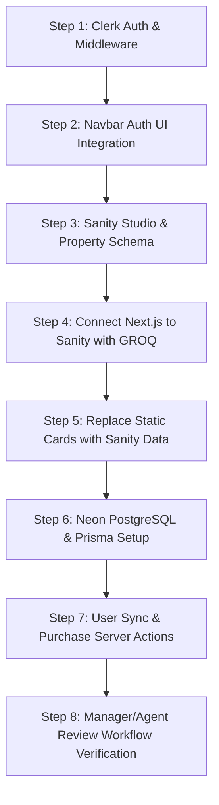

# Comprehensive Integration Plan: Clerk, Sanity CMS & Neon PostgreSQL (Prisma)

This plan outlines the architecture, current codebase state, and sequential execution roadmap for evolving the **Estatein Real Estate App** into a full-stack, production-ready real estate platform without altering or degrading any existing frontend styles, colors, spacing, typography, or UI design tokens.

---

## 1. Project Overview & Current State Analysis

### What Has Been Done So Far:
- **Frontend Architecture**: Built with **Next.js 16 (App Router)**, **React 19**, and **Tailwind CSS v4**.
- **Design System & Theme**: Custom dark luxury real estate theme using:
  - **Background**: `#141414` (Main dark canvas), `#1A1A1A` (Cards, navbar, footer containers)
  - **Borders**: `#262626` (Subtle 1px divider lines)
  - **Accent**: `#703BF7` (Estatein royal purple brand highlight)
  - **Typography**: Google Font `Urbanist` (`latin`), `#FFFFFF` headings, `#999999` muted body text
- **Core Pages & UI Components**:
  - `Header` with announcement banner, logo, navigation links, and mobile drawer.
  - `Home` (`Hero`, `FeaturedListings`, `Testimonials`, `Faqs`, `CtaBanner`).
  - `Properties` (`PropertyHeroSearch`, `PropertiesGrid`, `PropertiesCtaForm`).
  - `Property Details` (`PropertyDetailsHero`, `PropertyDescriptionAndAmenities`, `PropertyInquiryForm`, `ComprehensivePricing`).
  - `About Us` and `Footer` sections.
- **Recent Action**:
  - Created Git branch `feature/clerk-auth`.
  - Installed `@clerk/nextjs` dependency (`^7.7.1`).

### What Needs to Be Done (High-Level):
1. **Authentication (Clerk)**: Wrap layout with `<ClerkProvider>`, configure `middleware.ts` for route protection, add seamless Estatein-styled Auth buttons / `UserButton`, and handle role-based metadata (`CUSTOMER`, `AGENT`, `MANAGER`).
2. **CMS / Editorial Layer (Sanity)**: Configure Sanity Studio, define Property Schema (title, slug, price, beds, baths, area, images, status, amenities), and replace static property arrays with dynamic GROQ queries in Server Components.
3. **Database & Transactions (Neon PostgreSQL + Prisma)**: Initialize Prisma with Neon, configure tables for synced `User` profiles and `Purchase` transactions, and create Server Actions for purchasing properties.
4. **Agent/Manager Workflow**: Enforce Sanity publication workflow (`Draft` / `Pending Review` -> `Available` -> `Sold`) so public visitors only see approved properties.
5. **Zero-UI Degradation Guarantee**: Match all new interactive components (modals, auth widgets, dynamic cards) exactly to Estatein's `#141414` / `#1A1A1A` / `#703BF7` visual standard.

---

## 2. Source of Truth & Architecture Matrix

```
                      ┌──────────────────────────────────────────────┐
                      │              Clerk Auth                      │
                      │  (User Identity, Passwords, Roles, Sessions) │
                      └──────────────────────┬───────────────────────┘
                                             │
                                             ▼
┌───────────────────────────────┐  ┌───────────────────────┐  ┌─────────────────────────────────┐
│          Sanity CMS           │  │   Next.js App Router  │  │        Neon PostgreSQL          │
│ (Properties, Media, Amenities,│─>│ (Server Components,   │<─│  (Purchase Records, User Sync,  │
│    Agent/Manager Workflow)    │  │  Actions, Pages & UI) │  │    Transactional Data, Prisma)  │
└───────────────────────────────┘  └───────────────────────┘  └─────────────────────────────────┘
```

| Service | Primary Responsibility | Data Handled |
| :--- | :--- | :--- |
| **Clerk** | Authentication & Identity | Emails, passwords, OAuth, session JWTs, user public metadata (`role`). |
| **Sanity CMS** | Content & Property Management | Listings, photos, descriptions, pricing, status (`Draft`/`Available`/`Sold`), amenities. |
| **Neon + Prisma** | Relational & Transactional DB | User purchase history, checkout transactions, saved bookmarks, foreign keys. |
| **Next.js (Vercel)** | Full-Stack Web App & Rendering | Server-Side Rendering (SSR), Server Actions, API routes, Client UI state. |

---

## 3. Strict Frontend Preservation Guidelines

> [!IMPORTANT]
> **Zero Design Degradation Policy**:
> - All existing layout dimensions (`max-w-[1440px]`, `px-6 sm:px-10 lg:px-16`), font family (`Urbanist`), borders (`border-[#262626]`), background colors (`#141414`, `#1A1A1A`), and button styles (`#703BF7` hover states) will be strictly preserved.
> - Clerk UI components (`<SignInButton>`, `<SignUpButton>`, `<UserButton>`) will be customized using Clerk's `appearance` prop to adopt the Estatein dark theme tokens (dark background, purple accents, rounded-10px corners).
> - When dynamic Sanity properties replace static arrays, the rendered HTML and Tailwind classes inside property cards will remain identical to the existing card components.

---

## 4. Sequential Step-by-Step Implementation Roadmap



### Step 1: Clerk Authentication Integration & Middleware
1. **Environment Setup**:
   - Configure `NEXT_PUBLIC_CLERK_PUBLISHABLE_KEY` and `CLERK_SECRET_KEY` in `.env.local`.
   - Set redirect paths:
     - `NEXT_PUBLIC_CLERK_SIGN_IN_URL=/sign-in`
     - `NEXT_PUBLIC_CLERK_SIGN_UP_URL=/sign-up`
2. **Root Layout Provider**:
   - Wrap `app/layout.tsx` with `<ClerkProvider>` with dark theme variables matching Estatein colors (`#141414`, `#703BF7`).
3. **Route Protection Middleware**:
   - Create `middleware.ts` using `clerkMiddleware()` with public routes (`/`, `/properties`, `/properties/[id]`, `/about`, `/services`, `/contact`) and protected routes (`/dashboard`, `/checkout`, `/account`).

### Step 2: Navbar & Auth UI Integration (Design-Preserved)
1. **Header Updates**:
   - In `app/components/layout/Header.tsx`, add `<SignedOut>` and `<SignedIn>` controls next to the "Contact Us" CTA button.
   - For signed-out users: Display styled "Sign In" button matching existing Estatein pill button design (`bg-[#141414] border border-[#262626] hover:bg-[#1A1A1A]`).
   - For signed-in users: Render `<UserButton />` with matching dark popup dropdown.
2. **Dedicated Auth Pages**:
   - Create `app/sign-in/[[...sign-in]]/page.tsx` and `app/sign-up/[[...sign-up]]/page.tsx` styled to center neatly within the Estatein dark theme.

### Step 3: Sanity CMS Setup & Property Schema Architecture
1. **Sanity Client & Studio Configuration**:
   - Install `@sanity/client`, `@sanity/image-url`, `next-sanity`, and `sanity`.
   - Setup `sanity.config.ts` and `sanity/client.ts` with project ID, dataset (`production`), and API version.
   - Create embedded studio route at `app/studio/[[...tool]]/page.tsx` (accessible to agents and managers).
2. **Property Schema (`sanity/schemas/property.ts`)**:
   - `title`: String
   - `slug`: Slug (auto-generated from title)
   - `description`: Text / Portable Text
   - `price`: Number / String (formatted)
   - `propertyType`: String dropdown (Villa, Apartment, Cottage, Penthouse, House)
   - `bedrooms`: Number / String
   - `bathrooms`: Number / String
   - `area`: String (e.g., "2,500 sq ft")
   - `images`: Array of Images with hotspot
   - `status`: String dropdown with options:
     - `Draft`
     - `Pending Review`
     - `Available` (Publicly visible)
     - `Sold`
   - `featured`: Boolean (for homepage featured section)

### Step 4: Dynamic Property Data Fetching (GROQ & Server Components)
1. **Sanity Queries (`lib/sanity.queries.ts`)**:
   - `featuredPropertiesQuery`: Fetch properties where `status == "Available" && featured == true`.
   - `allPropertiesQuery`: Fetch all properties where `status in ["Available", "Sold"]` with optional filtering by type, price range, and location.
   - `propertyDetailQuery`: Fetch single property by slug or ID.
2. **Component Integration**:
   - Update `app/components/home/FeaturedListings.tsx` to receive Sanity data while keeping the exact card JSX, slider navigation, and badge aesthetics.
   - Update `app/components/properties/PropertiesGrid.tsx` to render live Sanity properties.
   - Update `app/propertydetails/[id]/page.tsx` to dynamically render property details based on Sanity document ID/slug.

### Step 5: Neon PostgreSQL & Prisma Database Layer
1. **Setup Neon Connection**:
   - Configure `DATABASE_URL` (direct connection) and `DIRECT_URL` in `.env.local`.
   - Install `prisma` (dev) and `@prisma/client`.
   - Initialize `prisma/schema.prisma`.
2. **Prisma Schema Definition**:
```prisma
datasource db {
  provider = "postgresql"
  url      = env("DATABASE_URL")
}

generator client {
  provider = "prisma-client-js"
}

enum Role {
  CUSTOMER
  AGENT
  MANAGER
}

model User {
  id        String     @id // Matches Clerk User ID
  email     String     @unique
  firstName String?
  lastName  String?
  role      Role       @default(CUSTOMER)
  purchases Purchase[]
  createdAt DateTime   @default(now())
  updatedAt DateTime   @updatedAt
}

model Purchase {
  id          String   @id @default(uuid())
  userId      String
  user        User     @relation(fields: [userId], references: [id])
  propertyId  String   // References Sanity Property Document ID
  pricePaid   Float
  purchasedAt DateTime @default(now())

  @@index([userId])
  @@index([propertyId])
}
```
3. **Database Migration**:
   - Run `npx prisma db push` or `npx prisma migrate dev --name init`.

### Step 6: User Synchronization & Purchase Transactions
1. **User Sync Webhook / Lazy Sync**:
   - Implement a Clerk webhook route (`app/api/webhooks/clerk/route.ts`) using `svix` to sync user registration (`user.created`, `user.updated`) into PostgreSQL.
   - Alternatively/supplementally: Implement an idempotent server helper `syncUser()` that ensures a user row exists upon authenticated actions.
2. **Purchase Server Action**:
   - Create `app/actions/purchase.ts`:
     - Authenticate request using Clerk `auth()`.
     - Verify property availability.
     - Create `Purchase` record in PostgreSQL via Prisma.
     - Optionally trigger Sanity mutation (or update status to `Sold`).

### Step 7: Agent and Manager Workflow Verification
1. **Role Enforcement**:
   - Assign `role: "AGENT"` or `role: "MANAGER"` in Clerk Public Metadata.
   - Agents create listings in Sanity Studio as `Draft` or `Pending Review`.
   - Managers review and change status to `Available`.
   - Next.js GROQ queries filter strictly by `status == "Available"` for public catalog.

---

## 5. Verification Plan

### Automated Verification:
- **TypeScript Check**: `npm run build` or `npx tsc --noEmit` to verify type safety across all components and Prisma/Sanity clients.
- **Linting**: `npm run lint` to ensure zero ESLint errors.

### Visual & Functional Manual Verification:
- **Design & Styling Check**:
  - Compare homepage, properties page, and detail page before and after integration.
  - Verify navbar alignment, announcement banner, footer links, and responsive mobile menu.
  - Confirm colors (`#141414`, `#1A1A1A`, `#262626`, `#703BF7`), padding, and typography (`Urbanist`) are completely unaltered.
- **Authentication Flow**:
  - Test sign-up, sign-in, and sign-out using Clerk.
  - Verify `<UserButton />` dropdown and session persistence.
- **Sanity Dynamic Listing Flow**:
  - Create test property in Sanity Studio as `Draft` -> verify it does NOT show on public website.
  - Change status to `Available` -> verify it appears immediately on `/properties` with correct image, price, and details.
- **Purchase & Database Flow**:
  - Test purchasing a property while logged in.
  - Check PostgreSQL via Prisma Studio (`npx prisma studio`) to confirm `Purchase` and `User` records are created with correct foreign keys.
